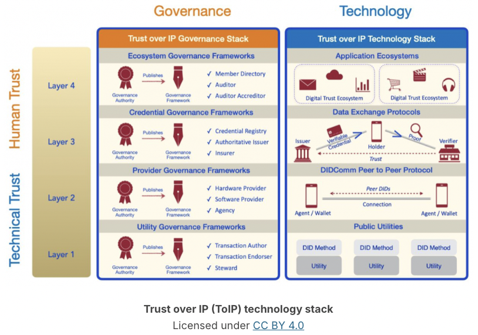

## Trust Over IP (ToIP)

- Linuz Foundation Organization that defines a complete architecture for Internet=scale disgital trust. 
- Combines Governance stack and technology stack 
- The technology stack is a typical layered stack, driven by technical components at each level. 
- governance stack defines the information to govern each layer of the stack.

- Aries implements Layer Two (peer-to-peer protocol) and Layer Three (Data Exchange, including VC) of Trust Over IP stack 
- Aries implements *DIDComm* - a secure, transport-agnostic mechanism for sending messages based on DIDs and set of data exchange protocols built on top of DIDComm.
- Aries enables the use of Layer 1 DID unitiy mechanisms, such as HL Indy. 
- Hyperledger AnonCreds sits on Layer 3 for privacy preserving VC. 
- Although Aries works really well with Indy and AnonCreds, *it can also be used with other Layer 1 utilities* and other VC fprmats, including JSON-LD based W3C standard VC signature schemes. 

## Decentralised Identifier (DID)

A decentralized identifier (DID) is a self-generated universally unique identifier (uuid) with some added power. DIDs are resolvable into a DID Document (DIDDoc) that contains (at least) cryptographic public keys owned by the controller of the DID that allow them to prove control over the DID.

An Aries agent 
- can publish an issuer’s public DID on a publically accessible Verifiable Data Registry (VDR), 
- and will include the DID, 
    - a public key and 
    - a DIDComm service containing physical endpoint (such as a URL) to which messages can be sent to the Aries agent.

Aries holders and verifiers *generally do not publish a DID* on a VDR because they don’t need a public DID to participate in the verifiable credential model. 

DIDs for people may **not** be published, blocked by *GDPR-type legal agreements* that ledger writers must accept before writing to the ledger.

**Peer DIDs** are created and exchanged peer-to-peer between pairs of messaging agents. Such DIDs are shared directly with the paired agent and so *do not need to be published* on a distributed ledger. 

## ZKP 

Hyperledger AnonCreds uses several ZKPs in a variety of ways to enable important privacy preserving verifiable credential features.

Use of a ZKP in AnonCreds is a **predicate ZKP** -  A predicate ZKP is a true/false expression proven (with cryptography) to a verifier based on a claim from an issued credential without sharing the underlying claim. For example, proving based on a "date of birth" claim that a person is older than a given age (e.g., older than 18) without providing the date of birth itself. 

A second important use of ZKPs in AnonCreds is in demonstrating that the holder presenting data to a verifier was the holder to which the credentials were issued. Through AnonCred, this demonstration is done with a ZKP, *without sharing a correlatable identifier* that can be used to track you. 

### How does it works?

**Blinded link secret** 

The issuer insert a value into the credential (a "blinded link secret"), that makes the issued credential uniquely yours.

When you present the credential, you provide a proof (containing a ZKP) that your blinded link secret was put into the credential by the issuer without revealing its value. Your proof is unique with every presentation—it is non-correlatable. 

A presentation using a blinded link secret still exposes the claims (the data) asked for by the verifier (which may uniquely identify the prover), but a unique identifier for the holder is not automatically provided as part of the process of presenting a proof.

## Selective Disclosure 

A key capability of Hyperledger AnonCreds is selective disclosure; being able to share just a selection of claims issued in a verifiable credential rather than being forced to share all of them in a presentation.

Example: a holder with a "driver’s license" type verifiable credential can share just their picture and that they are old enough to drink (using a ZKP predicate) to a bartender at a pub.

## Revocation 

Verifiable credential revocation is the capability for an issuer to publish (to everyone) that an issued verifiable credential is no longer active. This action is done unilaterally by the issuer, although they might inform the holder that their credential has been revoked. 

For verifiable credential **formats like AnonCreds that support ZKP capabilities** , revocation is a bit more complex than one might assume.

>  **ZKP Revocation**: In a simple revocation approach, the issuer might include a unique ID for the credential, and to revoke it, add the ID to a published list of revoked credential IDs. The holder shares the credential ID with the verifier, who can use the credential ID to check the registry and see if the credential has been revoked. The problem with that approach for a ZKP-enabled verifiable credential like AnonCreds is that the credential ID given to the verifier is a unique, correlatable identifier. That’s exactly what we want to avoid! With a ZKP revocation scheme, a credential ID is shared by the issuer to the holder, and there is a published revocation registry. However, the prover does not give the credential ID to the verifier. Instead, the prover generates a ZKP "non-revocation proof" that the verifier can check using the data in the published revocation registry without the holder sharing their credential ID. ZKPs are powerful, and useful!

## Verifiable Credentials Formats

### AnonCreds verifiable credential

Most Aries frameworks support the privacy-preserving Hyperledger AnonCreds verifiable credential that use a number of capabilities that we’ve outlined in this section, including support for *ZKPs*, *selective disclosure* and *ZKP revocation*.

JSON-LD W3C Standard Verifiable Credentials

- LD Signatures (JSON-LD signed with an Ed25519 key),
- BBS+ Signatures for JSON-LD.

How to choose what? 

When looking at different Aries agents, verifiable credential format support is an important differentiating factor. Want all the privacy-preserving features available today? AnonCreds is the way to go. Want W3C Standard Verifiable Credentials? JSON-LD credentials and signatures are your best bet, ideally using BBS+ so you get selective disclosure. 

>  Hyperledger AnonCreds project, and in particular around the idea of enabling AnonCreds verifiable credentials to be issued in W3C Verifiable Credentials Data Model Standard format.

> In fact, it may soon be possible to issue a credential with both an AnonCreds and LD Signature such that a holder can present a proof with AnonCreds privacy preserving capabilities or (if necessary) using a "show everything" LD Signature proof.

## Secure Storage 

Every Aries agent includes some kind of secure storage to hold its secrets. Most important of those secrets are the private keys that the agent creates and uses to sign data and decrypt messages from other agents.

The creation and use of private keys is generally handled within a **key management service (KMS)** that is within or associated with the agent’s secure storage. The KMS makes sure that private keys are used appropriately, and are not ever available to the Aries application code. 

Along with the Aries agent created keys, the secure storage holds other data that you don’t want others to access but need as an operational agent, such as 
- data about connections with other agents (peer DIDs and connection metadata), 
- verifiable credentials issued to you, 
- cached ledger objects, 
- and the state of protocols that are currently "in flight" (e.g., while your agent is being issued a credential).

All of the data in Aries secure storage is encrypted, with the decryption keys carefully managed. Most Aries implementations provide a way for "other data" to be stored in the Aries agent secure storage, but we usually discourage such use of Aries’ persistence. Our recommendation is that any business data not needed for the operation of the agent itself be stored in a separate "business" database. 

## Agent

Hyperledger Aries uses the term agent to mean the software that is operated by an entity. For example, a person might have a mobile agent wallet application on their smart device, while an organization might have an enterprise agent running on a server, perhaps in the cloud. 

