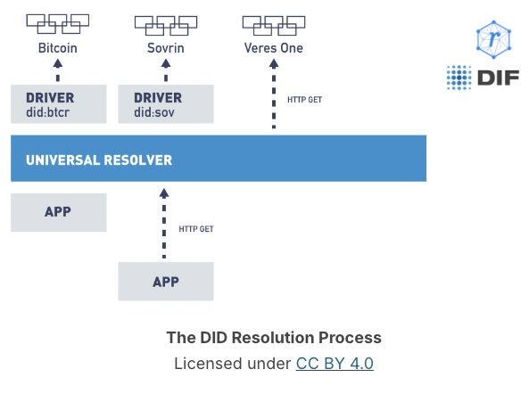

setting up VON network
https://github.com/bcgov/von-network/blob/main/docs/UsingVONNetwork.md

##  DID Resolution
An application (such as an Aries agent) needs to resolve a DID.
They call a Universal resolver 

