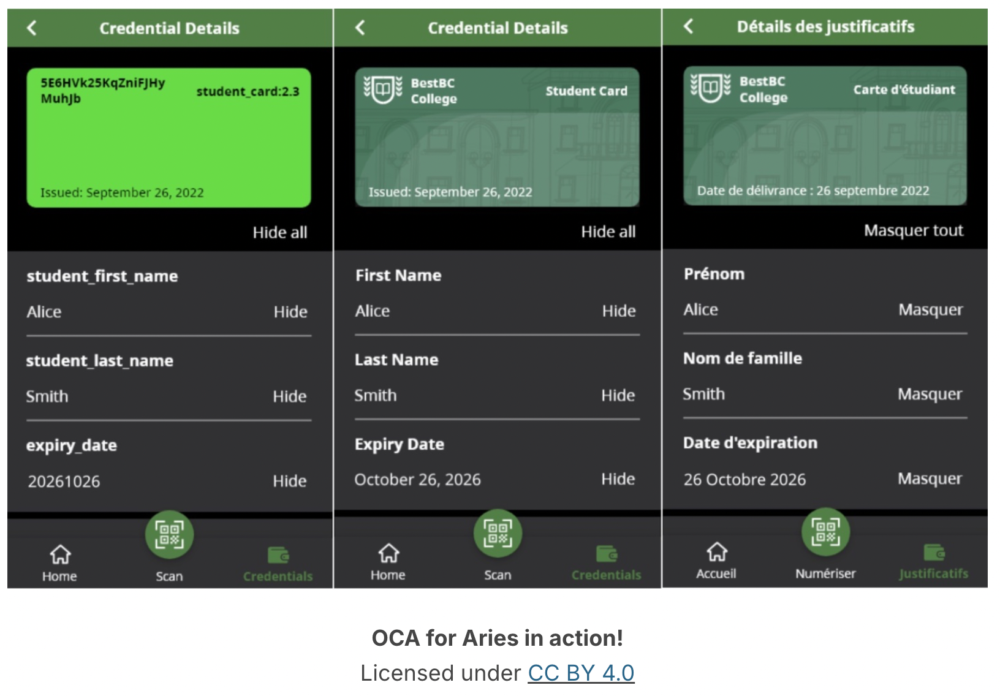
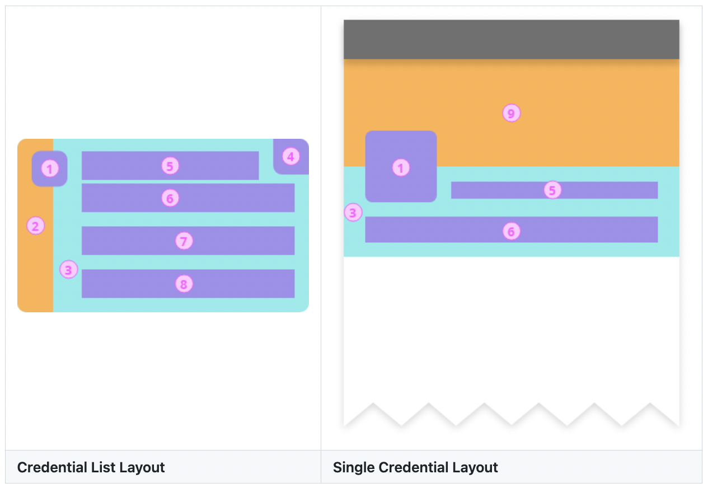

## Aries mobile wallets
Aries wallets are much like any other Aries agent we’ve talked about in the course. They embed a framework that handles all of the core Aries functionality—
- establishing connections, 
- managing secure storage, 
- exchanging credentials, and so on. 

On first startup, the wallet is initialized: 

- setting up the wallet’s secure storage 
- and setting up some sort of access security, either mobile OS biometrics, an application PIN, or both.
- A mediator connection is established

> When the wallet is secured using a biometric (fingerprint or face recognition), the operation is done entirely on the device. The biometric is **NOT** stored by the wallet and is not shared outside the wallet with anyone—the mobile OS maker, the wallet maker, the issuer, holder or verifier, and it is definitely not put on any sort of public ledger.

Once the wallet is initialized, users have a "front and center" button to trigger the scanning of QR codes.Once a connection has been established, the "other side" can send other Aries messages without needing to reestablish the connection, so an issuer might send presentation requests and get presentations as a prelude to issuing a credential, all using the same connection.

As both credentials and connections are collected, corresponding lists are created and made accessible to the wallet owner.

### Credential and Connection Lists

lists of credentials

connections (aka "contacts") 

### Beautiful Credentials and OCA for Aries

- pressure was added by business users to "make credentials beautiful."
-  they wanted issuers to have some control over how their credentials looked like in wallets, primarily for branding

> As was once said at an SSI-focused conference, "if an end user ever sees a DID, we have failed."

This is why [**Overlays Capture Architecture**](https://humancolossus.foundation/blog/cjzegoi58xgpfzwxyrqlroy48dihwz)

the use of OCA for the Aries credential use case allows issuers to convey, in a nice, well-defined and easy to create structure, the following items to holders and verifiers:

- The name of, and a description for, the credential and the issuer, in multiple languages.
- Help/support information about the credential, in multiple language
- Language specific links to website pages with information about the issuer, and how to get support about the issuance and use of the credential.
- Labels for, and help information about, each claim (attribute) in the credential, in multiple languages.
- The data type and format of each claim in the credential, so that the holder and verifier can properly render the attribute data on screen.
- A series of branding elements (images, colors, etc.) that allow the issuer to convey both their brand identity and the important attributes in their credential.

image below shows the same credential with no OCA support and with OCA support

- [RFC 0755 - Overlays Capture Architecture (OCA) For Aries](https://github.com/hyperledger/aries-rfcs/blob/main/features/0755-oca-for-aries/README.md)
- [RFC 0756 - OCA for Aries Style Guide](https://github.com/hyperledger/aries-rfcs/blob/main/features/0756-oca-for-aries-style-guide/README.md)

### Advanced Chat 

https://bloqzone.com/

[Aries RFC 0509: Action Menu Protocol](https://github.com/hyperledger/aries-rfcs/blob/main/features/0509-action-menu/README.md)

https://2060.io/

Several companies in the Aries space, including 2060.io and RootsID, are building out chat-centric Aries wallets that use DIDComm connectivity as the basis for both identity capabilities and trusted messaging.

## Aries Mobile Agent - React Native ("Bifold")

https://github.com/openwallet-foundation/bifold-wallet

The Bifold Wallet is an open-source project designed to enhance the way we interact with digital identities, making the process both secure and user-friendly. It is based on React Native, which lets it run smoothly on different devices and platforms, such as iOS, and Android. 

Aries Bifold is built on **Aries Framework JavaScript (AFJ)**

AJF support is limited to Indy ledgers and AnonCreds verifiable credentials, but with AFJ evolving quickly to support other ledgers and other verifiable credential formats, those capabilities will soon show up in Aries Bifold. 

[British Columbia (BC) Wallet repository](https://github.com/bcgov/bc-wallet-mobile) that contains only the overrides to Aries Bifold. 

When a build is triggered from the override repository, the resulting application, ready for publishing to the app stores is Aries Bifold overridden with changes made by the BC Gov team.

[Lab: Getting Started with the Aries Bifold Wallet](https://github.com/cloudcompass/ToIPLabs/blob/main/docs/LFS173xV2/MobileAgentLab.md)

